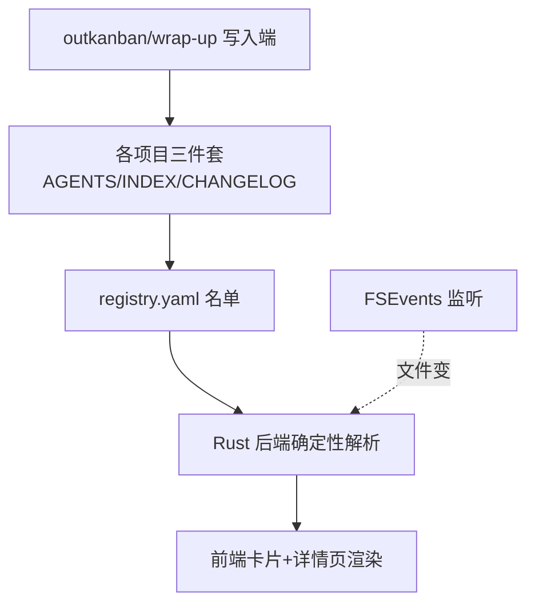

# tasktab

**TaskBoard**：一个 macOS 桌面任务看板应用，把所有项目的进度统一展示在一个零智能、纯读取文件的看板里。

> 🤖 Agent 上手先读 [`AGENTS.md`](./AGENTS.md) 的操作守则（通用协议在 [`docs/trio-protocol.md`](./docs/trio-protocol.md)）；改动后记得追加 [`CHANGELOG.md`](./CHANGELOG.md)（强标签格式见文件顶部）。进度走 CHANGELOG + 下方「当前接力点」。

## 上手 & 运行（小白版）

> v1.0 开发中，**还没打包**。要看/用看板，就用下面两条脚本——它们让 App 脱离 VSCode 独立活着（关 VSCode、关终端都不影响），改代码还能照常热更新。

```bash
# ▶ 启动看板（在项目根目录跑）
./scripts/dev-detached.sh
#   起来后 App 被系统接管，关 VSCode / 关终端都不会把它带走。
#   首次启动要编译 Rust，窗口可能等十几秒到一两分钟才弹。
#   想顺便看日志：./scripts/dev-detached.sh --logs（Ctrl-C 只退日志，不杀 App）

# ■ 关掉看板
./scripts/dev-stop.sh
#   连 vite 端口残留一起清干净。

# 改代码：照常在 VSCode 改即可。前端改动秒刷，Rust 改动它自己重编，无需重启脚本。
```

> 为什么不是双击 .app？因为还在 v1.0 边用边改，打包出来是固定快照、改了代码不更新；等 v1.0 定稿再走 `./scripts/install.sh` 正式打包。运行态文件落在 `.dev/`（已 gitignore）。

## 当前接力点 (Handoff)

> 此段是项目"下一步动作"导航位，**永远只保留最新一条**，覆盖式更新。拆 `### 概述`（App 标签页只抓这段）+ `### 明细`（给人看的展开）。详见 docs/trio-protocol.md §3。

### 概述
**线上服务端已切 GitHub 聚合模式并验证成功（board.json 带 generated_at + 7 项目 commit）—— 待真机点桌面 App 看同步徽章是否正确**
**隐患：旧 push 源仍可 POST /ingest 覆盖聚合数据，待在聚合模式下禁用该路由**

### 明细
**2026-06-19 切换完成**：线上 `tasktab-board` 服务端已从旧 push 模式切到 GitHub 聚合并验证成功——`https://kanban.alphaxbot.xyz/board.json` 出现 `generated_at` + 7 项目各自 `commit` SHA、`registry_error=null`、各项目无 error。环境变量 `TB_REGISTRY=xinxin6623/tasktab@main:server/registry.yaml` + `TB_GH_TOKEN` + `TB_POLL_SEC=60` 已注入 swarm service，日志 `[ingest]`→`[aggregate] 已更新 board.json（7 项目）`。

切换中修掉三个坑（详见 CHANGELOG 2026-06-19）：① scratch 镜像缺 CA 证书（Dockerfile 已补 alpine 拷 ca-certificates.crt）；② TB_REGISTRY 路径应指 `server/registry.yaml` 不是 `cli/`（后者 gitignore 不上 GitHub）；③ 旧 push 源残留（见下隐患）。重部署套路：本地 `server/build.sh` 交叉编译 → tar 传 ECS → ECS `docker build`（纯 scratch+COPY）→ `docker service update --image --force`。

**剩余待办：**

---以下为 2026-06-18 设备间同步改造存档（代码侧，已全部落地）---

架构从「App 推送」反转为「GitHub 单一真相 → 服务器聚合 → 各端只读」，两台设备各自 push 到 GitHub 即同步看板。代码四端全绿、本地真实聚合已验证：

- 服务端 `server/`：`github.go`（GitHub API 拉各 repo 三件套+commit，并发，7 repo ~3s）+ `parse.go`（Go 重写解析，逐函数对齐 `board.rs`，`parse_test.go` 同源断言）+ `main.go` 聚合循环（`TB_REGISTRY` 启用）。board.json 新增 `commit`/`generated_at`。
- App 端：`push.rs` 退役（→ `archive/push-retired/`），新增 `sync.rs`（只读 git 状态 + 只读拉 board.json）。前端 `sync.ts` 算同步徽章（已同步/待推送/待拉取/未提交/分叉），卡片显示徽章、顶栏显示服务器聚合时间。「App 端零网络」收敛为「仅两个受控只读例外」。
- registry 加 `github` 字段（owner/repo@branch），`cra` + App 内 add 都自动探测 git remote 填充。

**2026-06-18 增量**：feat/mobile-board-mirror 已 `--no-ff` 合进 main 并 push。registry 已纳入仓 `server/registry.yaml`（减肥版：只留 id/name/github/pinned，去掉本机绝对路径与退役的 progress_file；tasktab 自身 github 改 @main），push 到 main。**实测国内 ECS 能直连 GitHub**（api.github.com 200/1.9s、raw 可达、拉公开文件 200/3.5s）——聚合架构在国内服务器跑得通；轮询 60s，2-3.5s 延迟无所谓；聚合失败时保留上轮数据不崩。隐患：国内连 GitHub 长期不稳是常态、私有 repo 带 token 那条路待真配后验。

**待办：**
1. 真机：`./scripts/dev-detached.sh` 起桌面 App（先在 `.dev/push.env` 填 `TB_BOARD_URL=https://kanban.alphaxbot.xyz/board.json`），点开看同步徽章是否正确。
2. 隐患（建议尽早）：旧 push 源（某设备旧版 App）仍可 `POST /ingest` 覆盖聚合的 board.json；在聚合模式下禁用 `/ingest` 路由彻底杜绝。**两份解析同源铁律不涉及**，仅改 server 路由层。
3. 旧尾巴（不阻塞）：`scripts/install.sh` 仍装已退役 progress-tracker，打包前清掉；install.sh 正式打包路径需注入 `TB_BOARD_URL`。

> ⚠️ 服务端是外向操作，按守则改动前先与 James 确认。本次切换的 token 用完即弃需 revoke。

## 项目简介

一个 macOS 桌面任务看板，把所有项目进度集中一屏。每个项目用三件套维护自己的进度，TaskBoard 用 FSEvents 监听文件变化秒级刷新——看板零智能、文件是唯一真相。

## 架构图



## 项目进度

进度只看两处：[`CHANGELOG.md`](./CHANGELOG.md)（强标签记录）+ 上方「当前接力点 (Handoff)」。
（`PROJECT_PROGRESS.md` 已于 2026-06-14 退役，根目录老文件仅历史快照，勿写入。）

## 项目结构

```text
tasktab/
├── 同步看板files/        # 三份指导文档（设计权威来源，最终归档到 docs/）
│   ├── 00-README.md          # 文档包入口与冲突裁决规则
│   ├── 01-大白话说明书.md     # 产品意图与设计理由
│   ├── 02-实现步骤.md         # 执行计划主文档（数据契约 / 技术栈 / M1–M5）
│   └── 03-SKILL创建规则.md    # 写入端 skill 规范（progress-tracker 已退役）
├── docs/                 # 详细文档（持有 trio-protocol.md）
├── AGENTS.md             # agent 操作守则
├── INDEX.md              # 本文件
├── CHANGELOG.md          # 强标签演绎记录
├── PROJECT_PROGRESS.md   # ⚠️ 已退役，仅历史快照
├── app/                  # Tauri 2（src/ 前端 + src-tauri/ Rust 后端）— M2–M4
├── server/               # 手机查看：看板镜像服务端（Go 标准库）+ web/ 只读网页
├── cli/cra.py            # 登记 CLI（Python）— M1
├── scripts/
│   ├── dev-detached.sh   # ▶ 开发期独立启动（脱离 VSCode）
│   ├── dev-stop.sh       # ■ 停止开发实例
│   └── install.sh        # 一键打包安装（v1.0 定稿后用）— M5
└── archive/              # 已退役内容（kanban-retired 等）
```

## 子模块导航

| 路径 | 说明 | 状态 |
| --- | --- | --- |
| `同步看板files/` | 三份指导文档：产品意图 + 实现步骤 + skill 规则 | 已有（设计权威） |
| `docs/` | 通用三件套协议 `trio-protocol.md` | 已建 |
| `cli/` | `cra` CLI（M1 交付） | ✅ 已完成 |
| `app/` | Tauri 2 桌面应用（M2–M4 交付） | ✅ 已完成（待真机终验） |
| `server/` | 手机查看：看板镜像服务端 + 只读网页 | ✅ 已上线 ECS（kanban.alphaxbot.xyz），2026-06-19 切 GitHub 聚合模式 |
| `scripts/` | `dev-detached.sh` / `dev-stop.sh` 开发期启停 + `install.sh` 打包 | ✅ 已完成 |

## 常用操作

```bash
# 项目登记
# cra add . --name "我的项目"      把当前目录接入看板
# cra list                          列出所有项目及整体进度
# cra remove <id>                   从看板移除（不动项目文件）

# 开发期启停看板（见上「上手 & 运行」）
# ./scripts/dev-detached.sh         独立启动，脱离 VSCode
# ./scripts/dev-stop.sh             停止

# 正式打包（v1.0 定稿后）
# ./scripts/install.sh              软链 cra、构建并安装 TaskBoard.app
```

## 关键数据契约（速查，权威以 02 §1.1b/1.2 为准）

- **整体进度** = `CHANGELOG.md` `## 项目阶段` checkbox 完成数 / 总数，status 为 `done` 时强制 100%
- **registry 路径**：`~/.ai-vault/taskboard/registry.yaml`
- **看板字段来源**：三件套（见 AGENTS.md「看板数据契约」表）。PROGRESS.md schema 已废弃。

## 相关链接

- 📓 演绎记录 / 进度：[CHANGELOG.md](./CHANGELOG.md)
- 🤖 Agent 守则：[AGENTS.md](./AGENTS.md)
- 📐 设计权威：[同步看板files/02-实现步骤.md](./同步看板files/02-实现步骤.md)
- 🌐 GitHub 远端：<https://github.com/xinxin6623/tasktab> （PUBLIC，main 分支）
<!-- 在此补充：部署地址、issue tracker 等 -->
