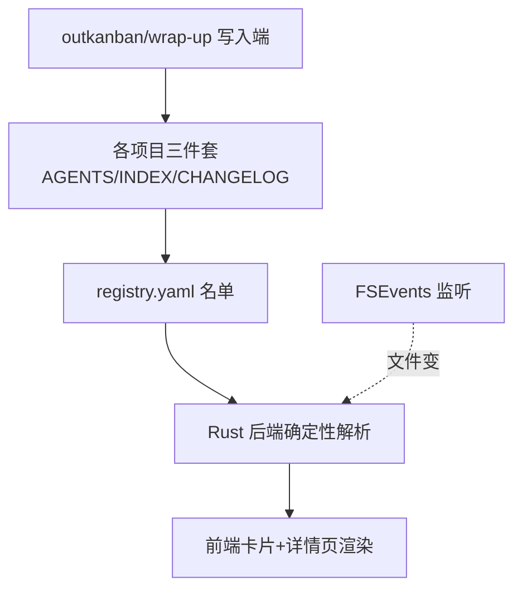

# tasktab

**TaskBoard**：一个 macOS 桌面任务看板应用，把所有项目的进度统一展示在一个零智能、纯读取文件的看板里。

> 🤖 Agent 上手先读 [`AGENTS.md`](./AGENTS.md) 的操作守则（通用协议在 [`docs/trio-protocol.md`](./docs/trio-protocol.md)）；改动后记得追加 [`CHANGELOG.md`](./CHANGELOG.md)（强标签格式见文件顶部），阶段性成果同步到 [`PROJECT_PROGRESS.md`](./PROJECT_PROGRESS.md)。

## 当前接力点 (Handoff)

> 此段是项目"下一步动作"导航位，**永远只保留最新一条**，覆盖式更新。详见 docs/trio-protocol.md §3。

- **2026-06-14**：架构已收敛到三件套（PROGRESS.md + /kanban 退役），App 改读三件套并真机验证通过（cc-switch + tasktab 自身都已发布到看板），项目宪法 AGENTS.md 已按新架构重写。下一步：跑 `./scripts/install.sh` 正式打包发布（.app 构建 + 装「应用程序」，留 James 拍板）。

## 项目简介

一个 macOS 桌面任务看板，把所有项目进度集中一屏。每个项目用三件套维护自己的进度，TaskBoard 用 FSEvents 监听文件变化秒级刷新——看板零智能、文件是唯一真相。

## 架构图



## 项目进度

给非工程读者看的当前阶段、已完成事项、下一步和风险：[`PROJECT_PROGRESS.md`](./PROJECT_PROGRESS.md)

## 项目结构

```
tasktab/
├── 同步看板files/        # 三份指导文档（设计权威来源，最终归档到 docs/）
│   ├── 00-README.md          # 文档包入口与冲突裁决规则
│   ├── 01-大白话说明书.md     # 产品意图与设计理由
│   ├── 02-实现步骤.md         # 执行计划主文档（数据契约 / 技术栈 / M1–M5）
│   └── 03-SKILL创建规则.md    # progress-tracker skill 规范与草稿
├── docs/                 # 详细文档（持有 trio-protocol.md）
├── AGENTS.md             # agent 操作守则
├── INDEX.md              # 本文件
├── CHANGELOG.md          # 强标签演绎记录
├── PROJECT_PROGRESS.md   # 非工程读者进度页
├── app/                  # Tauri 2（src/ 前端 + src-tauri/ Rust 后端）— M2–M4
├── cli/cra.py            # 登记 CLI（Python）— M1
├── skill/progress-tracker/SKILL.md   # 自动写进度 skill — M5
└── scripts/install.sh    # 一键安装脚本 — M5
```

## 子模块导航

| 路径 | 说明 | 状态 |
|---|---|---|
| `同步看板files/` | 三份指导文档：产品意图 + 实现步骤 + skill 规则 | 已有（设计权威） |
| `docs/` | 通用三件套协议 `trio-protocol.md` | 已建 |
| `cli/` | `cra` CLI（M1 交付） | ✅ 已完成 |
| `app/` | Tauri 2 桌面应用（M2–M4 交付） | ✅ 已完成（待真机终验） |
| `skill/` | `progress-tracker` skill（M5 交付） | ✅ 已完成 |
| `scripts/` | `install.sh` 安装脚本（M5 交付） | ✅ 已完成 |

## 常用操作

```bash
# 项目登记（M1 后可用）
# cra add . --name "我的项目"      把当前目录接入看板
# cra list                          列出所有项目及整体进度
# cra remove <id>                   从看板移除（不动项目文件）

# 构建安装（M5 后可用）
# ./scripts/install.sh              软链 cra、装 skill、构建并安装 TaskBoard.app
```

## 关键数据契约（速查，权威以 02 §1.1/1.2 为准）

- **整体进度** = `(current_stage - 1 + stage_progress/100) / len(stages)`，status 为 `done` 时强制 100%
- **registry 路径**：`~/.ai-vault/taskboard/registry.yaml`
- **每项目进度**：`<项目根>/PROGRESS.md`（frontmatter 结构化字段 + 自由正文）

## 相关链接

- 📍 项目进度：[PROJECT_PROGRESS.md](./PROJECT_PROGRESS.md)
- 📓 演绎记录：[CHANGELOG.md](./CHANGELOG.md)
- 🤖 Agent 守则：[AGENTS.md](./AGENTS.md)
- 📐 设计权威：[同步看板files/02-实现步骤.md](./同步看板files/02-实现步骤.md)
- 🌐 GitHub 远端：https://github.com/xinxin6623/tasktab （PUBLIC，main 分支）
<!-- 在此补充：部署地址、issue tracker 等 -->
