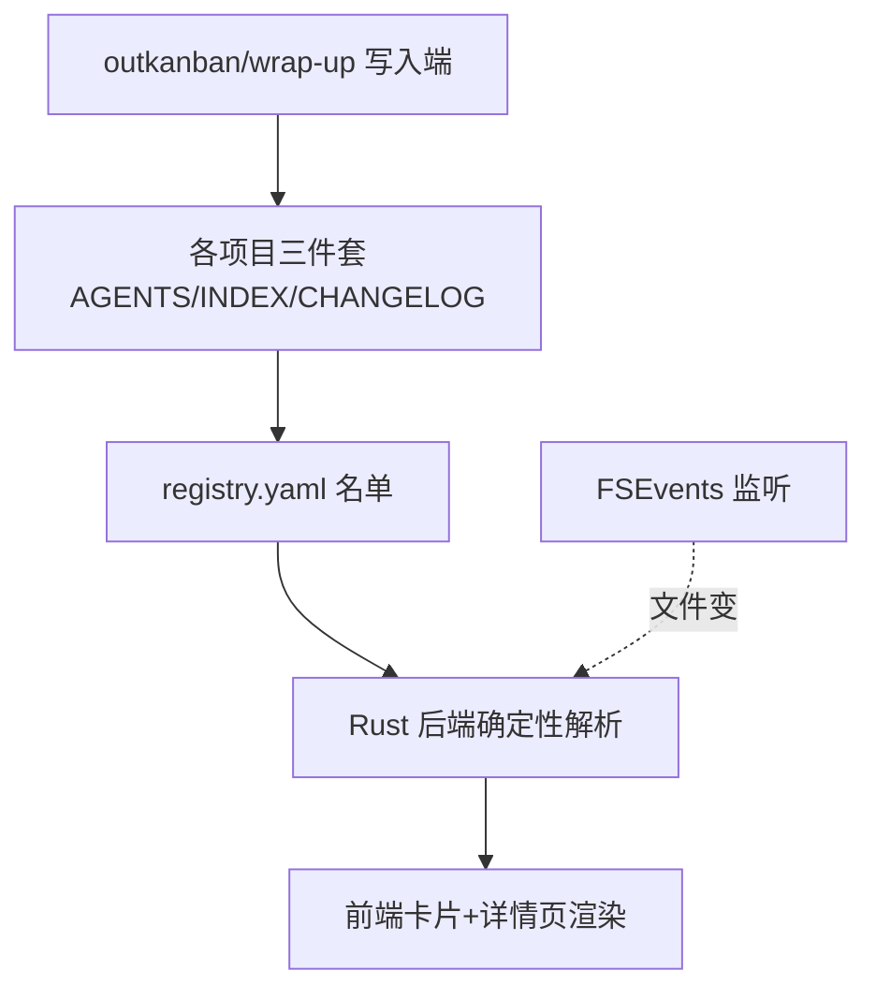

# tasktab

**TaskBoard**：一个 macOS 桌面任务看板应用，把所有项目的进度统一展示在一个零智能、纯读取文件的看板里。

> 🤖 Agent 上手先读 [`AGENTS.md`](./AGENTS.md) 的操作守则（通用协议在 [`docs/trio-protocol.md`](./docs/trio-protocol.md)）；改动后记得追加 [`CHANGELOG.md`](./CHANGELOG.md)（强标签格式见文件顶部）。进度走 CHANGELOG + 下方「当前接力点」。

## 上手 & 运行（小白版）

> v1.0 开发中，**还没打包**。要看/用看板，就用下面两条脚本——它们让 App 脱离 VSCode 独立活着（关 VSCode、关终端都不影响），改代码还能照常热更新。

```bash
# ▶ 启动看板（在项目根目录跑）
./scripts/dev-detached.sh
#   起来后 App 被系统接管，关 VSCode / 关终端都不会把它带走。
#   首次启动要编译 Rust，窗口可能等十几秒到一两分钟才弹。
#   想顺便看日志：./scripts/dev-detached.sh --logs（Ctrl-C 只退日志，不杀 App）

# ■ 关掉看板
./scripts/dev-stop.sh
#   连 vite 端口残留一起清干净。

# 改代码：照常在 VSCode 改即可。前端改动秒刷，Rust 改动它自己重编，无需重启脚本。
```

> 为什么不是双击 .app？因为还在 v1.0 边用边改，打包出来是固定快照、改了代码不更新；等 v1.0 定稿再走 `./scripts/install.sh` 正式打包。运行态文件落在 `.dev/`（已 gitignore）。

## 当前接力点 (Handoff)

> 此段是项目"下一步动作"导航位，**永远只保留最新一条**，覆盖式更新。拆 `### 概述`（App 标签页只抓这段）+ `### 明细`（给人看的展开）。详见 docs/trio-protocol.md §3。

### 概述
**继续 v1.0 开发（边用边改，用 `./scripts/dev-detached.sh` 起独立看板）；v1.0 定稿后再走 install.sh 正式打包**

### 明细
**2026-06-14**：① 开发期启停脚本就位（dev-detached / dev-stop，App 脱离 VSCode 常驻）。② PROJECT_PROGRESS 退役已升格为协议层 standard-v3，tasktab 升 v3（吸收器机制见 myskills/project-init/references/migrations.md）。

两个待清尾巴（不阻塞开发，定稿前处理）：

- `scripts/install.sh` 第 19/59-65 行仍装已退役的 progress-tracker skill，正式打包前清掉。
- App 端验收：dev 模式真机点开看板确认各项目卡片正常（cc-switch + tasktab 已发布）。

## 项目简介

一个 macOS 桌面任务看板，把所有项目进度集中一屏。每个项目用三件套维护自己的进度，TaskBoard 用 FSEvents 监听文件变化秒级刷新——看板零智能、文件是唯一真相。

## 架构图



## 项目进度

进度只看两处：[`CHANGELOG.md`](./CHANGELOG.md)（强标签记录）+ 上方「当前接力点 (Handoff)」。
（`PROJECT_PROGRESS.md` 已于 2026-06-14 退役，根目录老文件仅历史快照，勿写入。）

## 项目结构

```text
tasktab/
├── 同步看板files/        # 三份指导文档（设计权威来源，最终归档到 docs/）
│   ├── 00-README.md          # 文档包入口与冲突裁决规则
│   ├── 01-大白话说明书.md     # 产品意图与设计理由
│   ├── 02-实现步骤.md         # 执行计划主文档（数据契约 / 技术栈 / M1–M5）
│   └── 03-SKILL创建规则.md    # 写入端 skill 规范（progress-tracker 已退役）
├── docs/                 # 详细文档（持有 trio-protocol.md）
├── AGENTS.md             # agent 操作守则
├── INDEX.md              # 本文件
├── CHANGELOG.md          # 强标签演绎记录
├── PROJECT_PROGRESS.md   # ⚠️ 已退役，仅历史快照
├── app/                  # Tauri 2（src/ 前端 + src-tauri/ Rust 后端）— M2–M4
├── cli/cra.py            # 登记 CLI（Python）— M1
├── scripts/
│   ├── dev-detached.sh   # ▶ 开发期独立启动（脱离 VSCode）
│   ├── dev-stop.sh       # ■ 停止开发实例
│   └── install.sh        # 一键打包安装（v1.0 定稿后用）— M5
└── archive/              # 已退役内容（kanban-retired 等）
```

## 子模块导航

| 路径 | 说明 | 状态 |
| --- | --- | --- |
| `同步看板files/` | 三份指导文档：产品意图 + 实现步骤 + skill 规则 | 已有（设计权威） |
| `docs/` | 通用三件套协议 `trio-protocol.md` | 已建 |
| `cli/` | `cra` CLI（M1 交付） | ✅ 已完成 |
| `app/` | Tauri 2 桌面应用（M2–M4 交付） | ✅ 已完成（待真机终验） |
| `scripts/` | `dev-detached.sh` / `dev-stop.sh` 开发期启停 + `install.sh` 打包 | ✅ 已完成 |

## 常用操作

```bash
# 项目登记
# cra add . --name "我的项目"      把当前目录接入看板
# cra list                          列出所有项目及整体进度
# cra remove <id>                   从看板移除（不动项目文件）

# 开发期启停看板（见上「上手 & 运行」）
# ./scripts/dev-detached.sh         独立启动，脱离 VSCode
# ./scripts/dev-stop.sh             停止

# 正式打包（v1.0 定稿后）
# ./scripts/install.sh              软链 cra、构建并安装 TaskBoard.app
```

## 关键数据契约（速查，权威以 02 §1.1b/1.2 为准）

- **整体进度** = `CHANGELOG.md` `## 项目阶段` checkbox 完成数 / 总数，status 为 `done` 时强制 100%
- **registry 路径**：`~/.ai-vault/taskboard/registry.yaml`
- **看板字段来源**：三件套（见 AGENTS.md「看板数据契约」表）。PROGRESS.md schema 已废弃。

## 相关链接

- 📓 演绎记录 / 进度：[CHANGELOG.md](./CHANGELOG.md)
- 🤖 Agent 守则：[AGENTS.md](./AGENTS.md)
- 📐 设计权威：[同步看板files/02-实现步骤.md](./同步看板files/02-实现步骤.md)
- 🌐 GitHub 远端：<https://github.com/xinxin6623/tasktab> （PUBLIC，main 分支）
<!-- 在此补充：部署地址、issue tracker 等 -->
